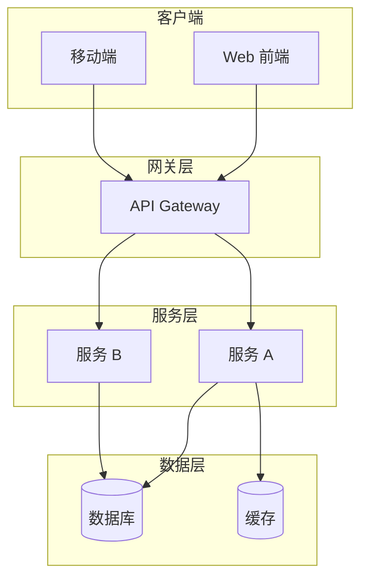
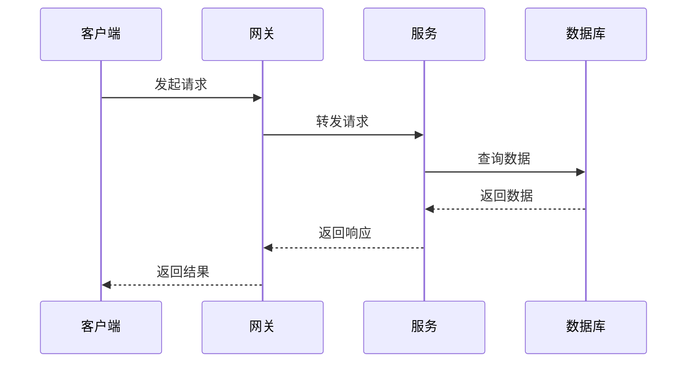

# DES 文档模板（标准版）

本文档为 `/design` 命令的标准版模板。

---

# DES-{YYYYMMDD}-{序号}-{名称}

| 字段 | 值 |
|------|-----|
| 文档编号 | DES-{YYYYMMDD}-{序号}-{名称} |
| 关联需求 | REQ-{YYYYMMDD}-{序号}-{名称} |
| 创建日期 | {YYYY-MM-DD} |
| 负责人 | {负责人} |
| 状态 | 草稿 / 评审中 / 已批准 |
| 最后更新 | {YYYY-MM-DD} |

---

## 一、概述

### 1.1 设计目标

{描述本次设计的目标，包括要解决的问题、达成的效果}

### 1.2 设计原则

{列出设计遵循的原则，如：}
- 单一职责原则
- 开闭原则
- 最小权限原则
- ...

---

## 二、项目现状分析

> 本章节基于对现有项目代码的分析，确保设计方案与现有系统良好融合。

### 2.1 技术栈概览

| 层级 | 当前技术 | 版本 |
|------|----------|------|
| 运行时 | {从项目配置提取} | |
| 框架 | {从项目配置提取} | |
| 数据库 | {从项目配置提取} | |
| 缓存 | {从项目配置提取} | |

### 2.2 项目结构

```
{从项目目录结构提取关键目录布局}
project-root/
├── src/
│   ├── main/
│   └── test/
├── docs/
└── ...
```

### 2.3 相关现有模块

| 模块名 | 位置 | 与本次设计的关系 |
|--------|------|------------------|
| {模块名} | {路径} | {可复用/需扩展/需修改} |

### 2.4 设计约束（来自现有代码）

{列出从现有代码中识别的约束条件，如：}
- 分层约定：Controller → Service → Repository
- 命名规范：{从代码提取}
- 响应格式：{从现有 API 提取}
- ...

---

## 三、架构设计

### 3.1 系统架构图



{架构说明文字}

### 3.2 模块划分

| 模块名称 | 职责 | 技术选型 | 说明 |
|----------|------|----------|------|
| {模块名} | {职责描述} | {技术栈} | {补充说明} |
| {模块名} | {职责描述} | {技术栈} | {补充说明} |
| ... | ... | ... | ... |

---

## 四、接口设计

### 4.1 接口列表

| 序号 | 接口名称 | HTTP 方法 | 路径 | 说明 |
|------|----------|-----------|------|------|
| 1 | {接口名} | GET/POST/PUT/DELETE | {路径} | {说明} |
| 2 | {接口名} | GET/POST/PUT/DELETE | {路径} | {说明} |
| ... | ... | ... | ... | ... |

### 4.2 接口详情

#### 4.2.1 {接口名称}

**基本信息**

| 项目 | 值 |
|------|-----|
| 路径 | {路径} |
| 方法 | {HTTP 方法} |
| 描述 | {接口描述} |

**请求参数**

| 参数名 | 类型 | 必填 | 来源 | 说明 |
|--------|------|------|------|------|
| {参数名} | {类型} | 是/否 | path/query/body/header | {说明} |

**请求示例**

```json
{
  "param1": "value1",
  "param2": "value2"
}
```

**响应示例**

```json
{
  "code": 0,
  "message": "success",
  "data": {
    "field1": "value1",
    "field2": "value2"
  }
}
```

> 响应格式需与宪法中定义的统一响应结构一致。

**错误码**

| 错误码 | 含义 | 处理建议 |
|--------|------|----------|
| 0 | 成功 | - |
| 1xx | 参数错误 | 检查请求参数 |
| 2xx | 业务错误 | 参考 message 处理 |
| 5xx | 系统错误 | 联系管理员 |

> 错误码需与宪法中定义的错误码规范一致。

---

## 五、数据库设计

### 5.1 表结构变更

#### 5.1.1 新增表：{表名}

| 字段名 | 类型 | 必填 | 默认值 | 说明 |
|--------|------|------|--------|------|
| id | BIGINT | 是 | AUTO_INCREMENT | 主键 |
| created_at | DATETIME | 是 | CURRENT_TIMESTAMP | 创建时间 |
| updated_at | DATETIME | 是 | CURRENT_TIMESTAMP | 更新时间 |
| ... | ... | ... | ... | ... |

**建表 SQL**

```sql
CREATE TABLE `t_xxx` (
  `id` BIGINT NOT NULL AUTO_INCREMENT,
  `created_at` DATETIME NOT NULL DEFAULT CURRENT_TIMESTAMP,
  `updated_at` DATETIME NOT NULL DEFAULT CURRENT_TIMESTAMP ON UPDATE CURRENT_TIMESTAMP,
  PRIMARY KEY (`id`)
) ENGINE=InnoDB DEFAULT CHARSET=utf8mb4 COMMENT='表说明';
```

> 表名、字段名需与宪法中定义的数据库规范一致。

### 5.2 索引设计

| 索引名 | 索引类型 | 字段 | 说明 |
|--------|----------|------|------|
| idx_xxx | 普通/唯一 | 字段1, 字段2 | 索引说明 |

### 5.3 迁移脚本

迁移脚本命名：`V{版本号}__{描述}.sql`

```sql
-- 迁移脚本内容
```

---

## 六、时序图

### 6.1 {场景名称}



{时序说明文字}

---

## 七、配置变更

### 7.1 环境变量

| 变量名 | 类型 | 必填 | 默认值 | 说明 |
|--------|------|------|--------|------|
| {变量名} | {类型} | 是/否 | {默认值} | {说明} |

### 7.2 配置文件片段

```yaml
# application.yml 示例
service:
  feature:
    enabled: true
    timeout: 30s
```

---

## 八、多服务改动

### 8.1 涉及服务

| 服务名称 | 改动类型 | 说明 |
|----------|----------|------|
| {服务名} | 新增/修改/删除 | {改动说明} |

### 8.2 分支规划

| 服务 | 分支名 | 说明 |
|------|--------|------|
| {服务名} | feature/xxx | 功能开发分支 |

### 8.3 改动说明

{详细描述各服务的改动内容}

---

## 九、业界方案参考

### 9.1 参考方案

{描述业界类似场景的解决方案}

### 9.2 技术选型对比

| 方案 | 优点 | 缺点 | 适用场景 |
|------|------|------|----------|
| {方案A} | {优点} | {缺点} | {场景} |
| {方案B} | {优点} | {缺点} | {场景} |

### 9.3 最终选择

{说明选择某方案的原因}

---

## 十、测试点（详细）

### 10.1 单元测试点

| 模块 | 测试场景 | 预期结果 |
|------|----------|----------|
| {模块名} | {场景描述} | {预期结果} |

**详细测试点**：
- [ ] {测试点1}
- [ ] {测试点2}
- [ ] {测试点3}

### 10.2 集成测试点

| 测试场景 | 测试步骤 | 预期结果 |
|----------|----------|----------|
| {场景描述} | {步骤} | {预期结果} |

**详细测试点**：
- [ ] {测试点1}
- [ ] {测试点2}

### 10.3 E2E 测试场景

> 若项目宪法/REQ 明确不做前端，可标注「不适用 / N/A」并引用宪法条款。

| 场景 | 测试步骤 | 预期结果 |
|------|----------|----------|
| {场景名} | {步骤} | {预期结果} |

---

## 十一、风险与注意事项

### 11.1 技术风险

| 风险项 | 影响 | 缓解措施 |
|--------|------|----------|
| {风险描述} | {影响程度} | {缓解措施} |

### 11.2 注意事项

- {注意事项1}
- {注意事项2}
- ...

### 11.3 宪法偏离说明

> 若设计中存在与宪法不一致的地方，在此说明偏离原因及用户授权记录。

| 宪法条款 | 设计偏离 | 原因 | 授权记录 |
|----------|----------|------|----------|
| {条款} | {偏离内容} | {原因} | {用户确认记录} |

---

## 十二、变更记录

| 版本 | 日期 | 变更类型 | 变更内容 | 变更原因 |
|------|------|----------|----------|----------|
| v1.0 | {YYYY-MM-DD} | 新增 | 初始版本 | - |

---

> 本文档由 `/design` 命令生成，遵循 AICoding 范式规范。
