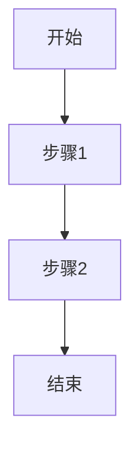

# REQ 文档模板（标准版）

本文档为 `/req` 命令的标准版模板。

---

# REQ-{YYYYMMDD}-{序号}-{名称}

| 字段 | 值 |
|------|-----|
| 文档编号 | REQ-{YYYYMMDD}-{序号}-{名称} |
| 创建日期 | {YYYY-MM-DD} |
| 负责人 | {负责人} |
| 状态 | 草稿 / 评审中 / 已批准 |
| 最后更新 | {YYYY-MM-DD} |

---

## 一、用户故事

作为一名 **[角色]**，我希望 **[功能]**，以便 **[目的]**。

**示例**：
> 作为一名电商用户，我希望能够查看订单历史，以便追踪我的购买记录。

---

## 二、目标用户

| 用户类型 | 描述 | 核心诉求 |
|----------|------|----------|
| {类型1} | {描述} | {诉求} |
| {类型2} | {描述} | {诉求} |
| ... | ... | ... |

---

## 三、需求背景

### 3.1 业务背景

{描述当前业务现状和背景}

### 3.2 要解决的问题

{列出当前存在的问题或痛点}

### 3.3 预期收益

{描述解决问题后带来的收益}

---

## 四、需求详细说明

### 4.1 功能列表

| 序号 | 功能点 | 优先级 | 说明 |
|------|--------|--------|------|
| 1 | {功能名} | P0/P1/P2 | {功能说明} |
| 2 | {功能名} | P0/P1/P2 | {功能说明} |
| ... | ... | ... | ... |

### 4.2 业务流程

{流程说明文字}

---

## 五、本期边界

### 5.1 本期范围

**本期要交付的功能/场景**：

- {功能/场景1}
- {功能/场景2}
- ...

### 5.2 本期不做

**明确排除的功能/场景**：

- {排除项1}
- {排除项2}
- ...

> 注意：「本期不做」是防止范围蔓延的关键，请明确列出不在本期实现的功能。

---

## 六、历史相关需求

| REQ 编号 | 关系 | 说明 |
|----------|------|------|
| {编号} | 前置/关联/后续 | {说明} |
| ... | ... | ... |

若无相关需求，填写「无」或「待补充」。

---

## 七、行业情况

### 7.1 业界参考

{业界类似产品或解决方案}

### 7.2 竞品分析

| 竞品 | 功能特点 | 可借鉴点 |
|------|----------|----------|
| {竞品名} | {特点} | {借鉴点} |

---

## 八、验收要求

### 8.1 验收标准

- [ ] {验收标准1}
- [ ] {验收标准2}
- [ ] {验收标准3}
- ...

### 8.2 完成定义（DoD）

- [ ] 功能开发完成
- [ ] 单元测试通过
- [ ] 代码审查通过
- [ ] 文档更新完成
- [ ] 集成测试通过
- [ ] 产品验收通过

---

## 九、附录

### 变更记录

| 版本 | 日期 | 变更类型 | 变更内容 | 变更原因 |
|------|------|----------|----------|----------|
| v1.0 | {YYYY-MM-DD} | 新增 | 初始版本 | - |

---

> 本文档由 `/req` 命令生成，遵循 AICoding 范式规范。